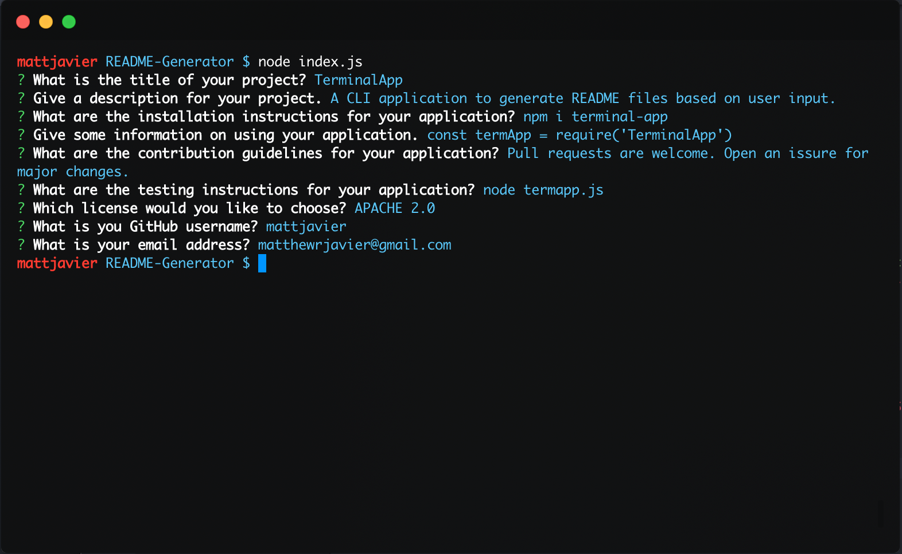
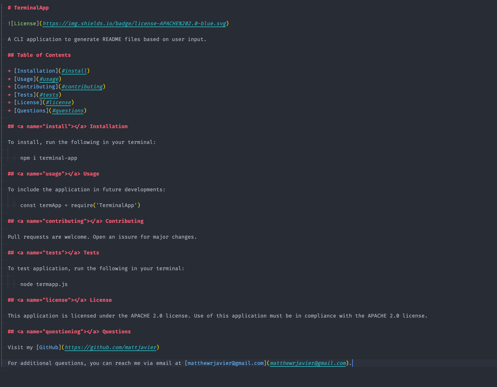
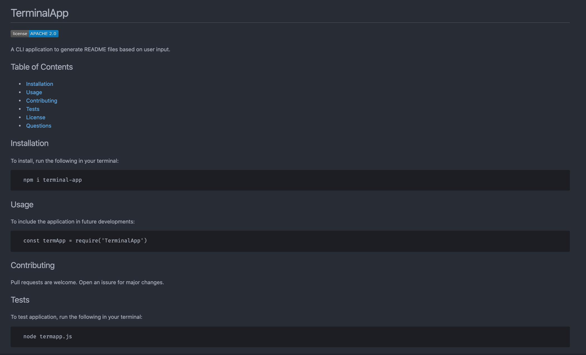

# README Generator

A CLI application that generates a README.md file, utilizing user input.

## Install

This application runs in the terminal, so upon downloading, some additional files may be required.

Run the following into your terminal to get all the necessary files:

```bash
npm i
```

You should then receive all the files needed in the `node_modules/` directory.  

## Usage 

To run, type the following into your terminal:

```bash
node index.js
```

You will then be prompted with questions. Answer accordingly, then a new `.md` file, named `testREADME.md` will be added to your current directory. This is the newly generated README file.

## Images

* Terminal output after running the program


* `testREADME.md` file contents


* `testREADME.md` rendered markdown


## Video

A demo video is available in the `assets/` directory. You can also view the demo video [here](https://drive.google.com/file/d/1ISzOAWoMfL_XAEqlropy_jq-EBOmyPov/view).